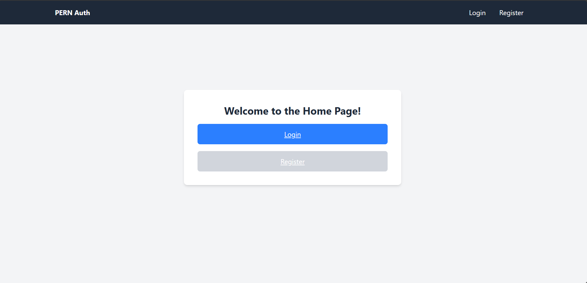
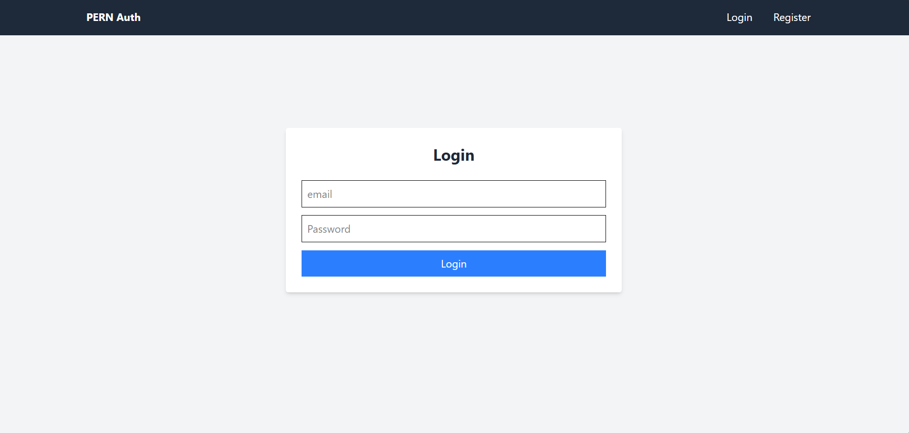
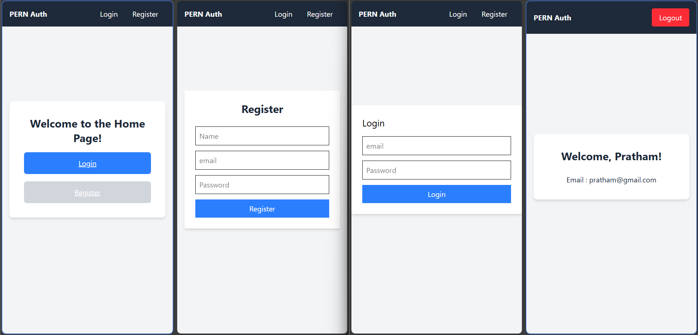

# PERN Authentication System

A simple **authentication system** built with the **PERN stack** (PostgreSQL, Express.js, React, Node.js) using **JWT tokens** for secure user sessions and **bcrypt** for password hashing.

This project demonstrates a basic **user registration, login, logout, and protected routes** functionality with a React frontend and Express backend.

---

## Technologies Used :-

**Backend:**

- Node.js & Express.js
- PostgreSQL
- bcryptjs for password hashing
- JSON Web Tokens (JWT) for authentication
- dotenv for environment variables
- cookie-parser for handling cookies
- CORS configuration for frontend-backend communication

**Frontend:**

- React.js (with Hooks)
- React Router v6 for client-side routing
- Axios for HTTP requests
- Tailwind CSS for styling

---

##  Features :-

- **User Registration:** Users can create an account with name, email, and password. Passwords are hashed before storing in the database.
- **User Login:** Users can log in using email and password. JWT tokens are issued and stored in HTTP-only cookies.
- **Protected Routes:** Certain routes (like `/me`) are accessible only to authenticated users.
- **Logout:** Users can log out, clearing the JWT cookie.
- **Error Handling:** Displays proper error messages for invalid credentials or missing input.

---

##  Installation :-

### 1️ Backend Setup

```bash
cd backend
npm i express pg bcryptjs jsonwebtoken cookie-parser dotenv
npm i nodemon -D
npm run dev
```
### 2 Frontend Setup

```bash
cd frontend
npm i tailwindcss @tailwindcsss/vite
npm i axios react-router-dom
npm run dev
```






